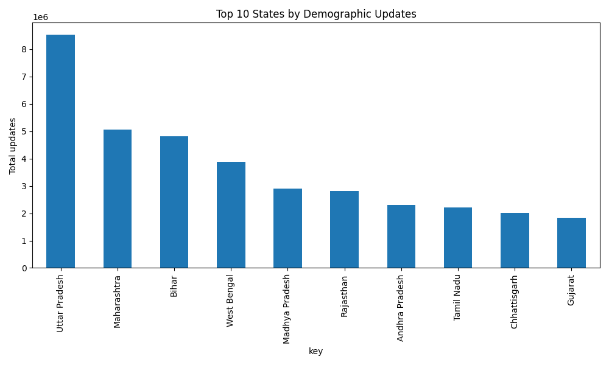
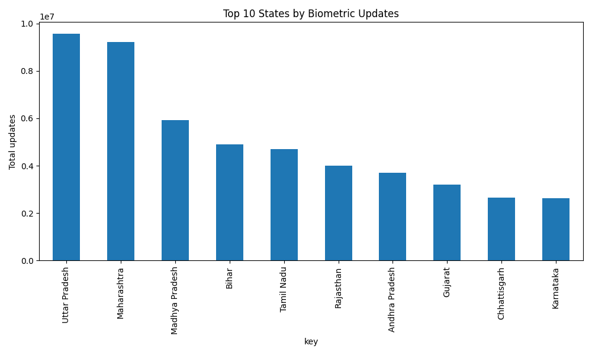
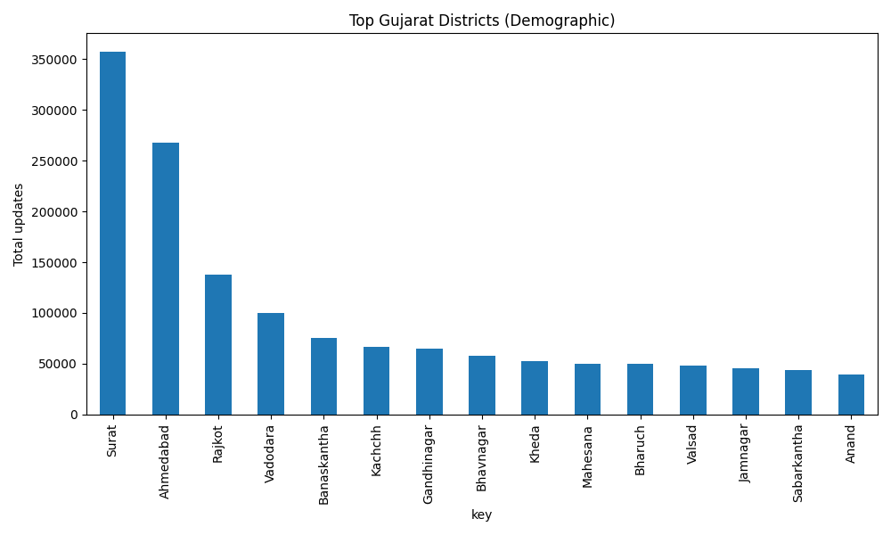
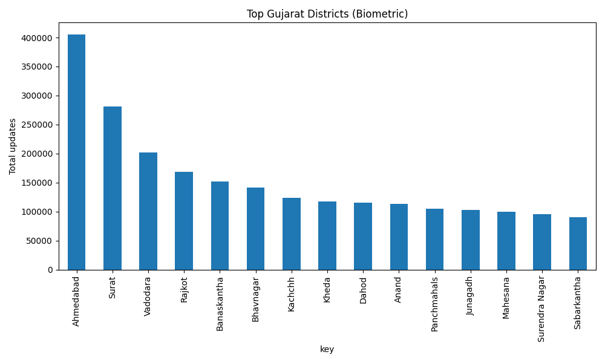

# Aadhaar Analytics Report

## Top states by demographic updates (total)

| key            | total_updates |
| :------------- | ------------: |
| Uttar Pradesh  |   8.54233e+06 |
| Maharashtra    |    5.0546e+06 |
| Bihar          |   4.81435e+06 |
| West Bengal    |   3.87217e+06 |
| Madhya Pradesh |   2.91294e+06 |
| Rajasthan      |   2.81762e+06 |
| Andhra Pradesh |    2.2955e+06 |
| Tamil Nadu     |   2.21223e+06 |
| Chhattisgarh   |   2.00543e+06 |
| Gujarat        |   1.82433e+06 |
| Karnataka      |   1.69528e+06 |
| Telangana      |   1.62991e+06 |
| Delhi          |   1.43893e+06 |
| Jharkhand      |   1.40119e+06 |
| Haryana        |   1.16614e+06 |
| Odisha         |   1.08324e+06 |
| Assam          |   1.01258e+06 |
| Punjab         |        881895 |
| Kerala         |        744952 |
| Uttarakhand    |        463637 |

## Top states by biometric updates (total)

| key               | total_updates |
| :---------------- | ------------: |
| Uttar Pradesh     |   9.57774e+06 |
| Maharashtra       |   9.22614e+06 |
| Madhya Pradesh    |   5.92377e+06 |
| Bihar             |   4.89759e+06 |
| Tamil Nadu        |   4.69812e+06 |
| Rajasthan         |   3.99496e+06 |
| Andhra Pradesh    |   3.71459e+06 |
| Gujarat           |   3.19651e+06 |
| Chhattisgarh      |   2.64873e+06 |
| Karnataka         |   2.63595e+06 |
| West Bengal       |   2.52445e+06 |
| Odisha            |   2.40283e+06 |
| Jharkhand         |    2.0263e+06 |
| Punjab            |   1.73967e+06 |
| Telangana         |   1.73765e+06 |
| Haryana           |   1.63545e+06 |
| Kerala            |   1.60973e+06 |
| Delhi             |   1.30436e+06 |
| Assam             |        982722 |
| Jammu and Kashmir |        791218 |

## Gujarat - Top districts (demographic)

| key            | total_updates |
| :------------- | ------------: |
| Surat          |        357582 |
| Ahmedabad      |        267884 |
| Rajkot         |        137600 |
| Vadodara       |        100027 |
| Banaskantha    |         75207 |
| Kachchh        |         66789 |
| Gandhinagar    |         64588 |
| Bhavnagar      |         57862 |
| Kheda          |         52619 |
| Mahesana       |         50217 |
| Bharuch        |         49806 |
| Valsad         |         48343 |
| Jamnagar       |         45719 |
| Sabarkantha    |         43877 |
| Anand          |         39149 |
| Surendra Nagar |         38759 |
| Junagadh       |         38045 |
| Dahod          |         35936 |
| Panchmahals    |         32470 |
| Navsari        |         29602 |

## Gujarat - Top districts (biometric)

| key            | total_updates |
| :------------- | ------------: |
| Ahmedabad      |        405490 |
| Surat          |        281599 |
| Vadodara       |        201417 |
| Rajkot         |        168711 |
| Banaskantha    |        151757 |
| Bhavnagar      |        141152 |
| Kachchh        |        123961 |
| Kheda          |        117161 |
| Dahod          |        115675 |
| Anand          |        113695 |
| Panchmahals    |        104768 |
| Junagadh       |        102672 |
| Mahesana       |         99913 |
| Surendra Nagar |         95711 |
| Sabarkantha    |         90387 |
| Valsad         |         84024 |
| Jamnagar       |         81102 |
| Gandhinagar    |         76564 |
| Bharuch        |         76378 |
| Patan          |         73949 |

## Charts

## Insights

- **High-volume states:** Uttar Pradesh and Maharashtra show consistently high demographic and biometric update volumes, indicating sustained service demand and need for expanded update centers.
- **Gujarat concentration:** Ahmedabad and Surat dominate update requests, suggesting urban migration and frequent address/mobile changes in these urban centers.
- **Biometric revalidation:** High biometric update counts in several populous states point to age-related revalidation and quality-correction needs.

## Recommendations

- **Scale resources:** Allocate additional enrollment/update centers and staffing to top-demand states (UP, Maharashtra, Bihar).
- **Targeted outreach:** Conduct mobile camps in high-update districts within Gujarat (Ahmedabad, Surat, Rajkot) focusing on address and mobile update facilitation.
- **Biometric quality program:** Implement periodic biometric revalidation initiatives in high biometric-update regions to reduce repeat visits.

## Forecast Summary

- **Overall outlook:** Short-term (12-week) forecasts for top states indicate sustained update volumes for Uttar Pradesh and Maharashtra; week-to-week variation is expected but median weekly demand remains elevated compared to smaller states.
- **Gujarat districts:** Forecasts for Ahmedabad and Surat show continued high weekly update counts over the next three months; Rajkot and Vadodara remain significant but lower in magnitude.
- **Actionable timing:** Forecast charts sometimes show specific weeks with higher predicted demand—use these as triggers to deploy temporary mobile camps or increase staffing for those weeks.

## Forecast Caveats & Suggestions

- **Data limitations:** Models use weekly-resampled historical totals and simple Holt–Winters smoothing; accuracy falls when data is sparse or when one-off campaigns occur.
- **Operational suggestion:** Treat forecasts as demand indicators—prioritize flexible resource allocation (rotating staff, mobile units) rather than fixed infrastructure changes until multi-period forecasts confirm trends.
- **Next analytical steps:** For higher accuracy, compare with ARIMA/Prophet models and incorporate external event calendars (enrollment drives, policy changes) as covariates.
